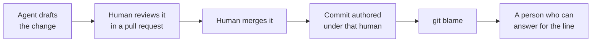
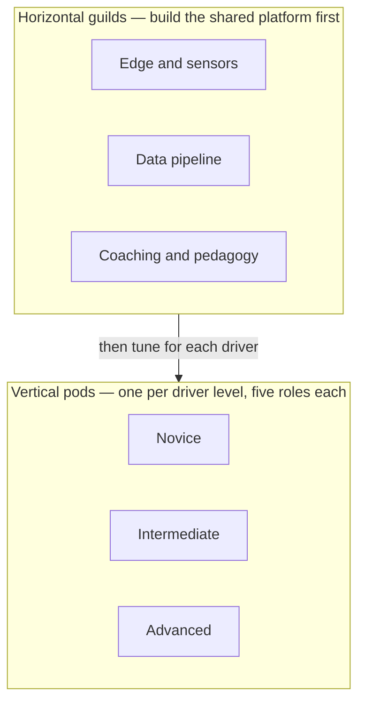
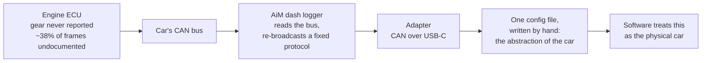
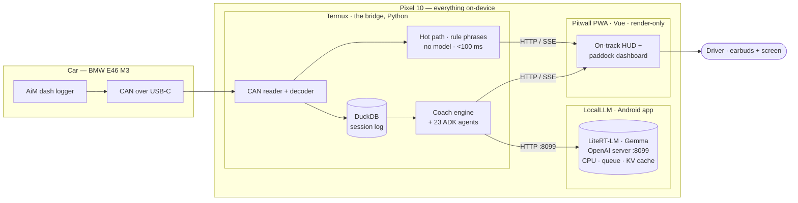
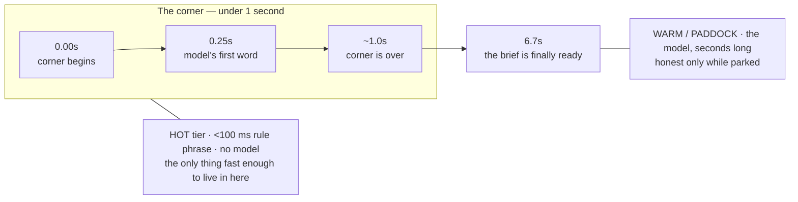
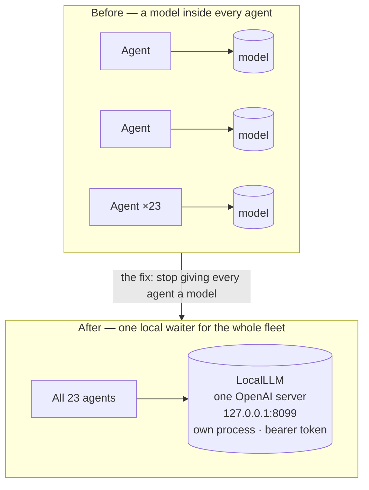
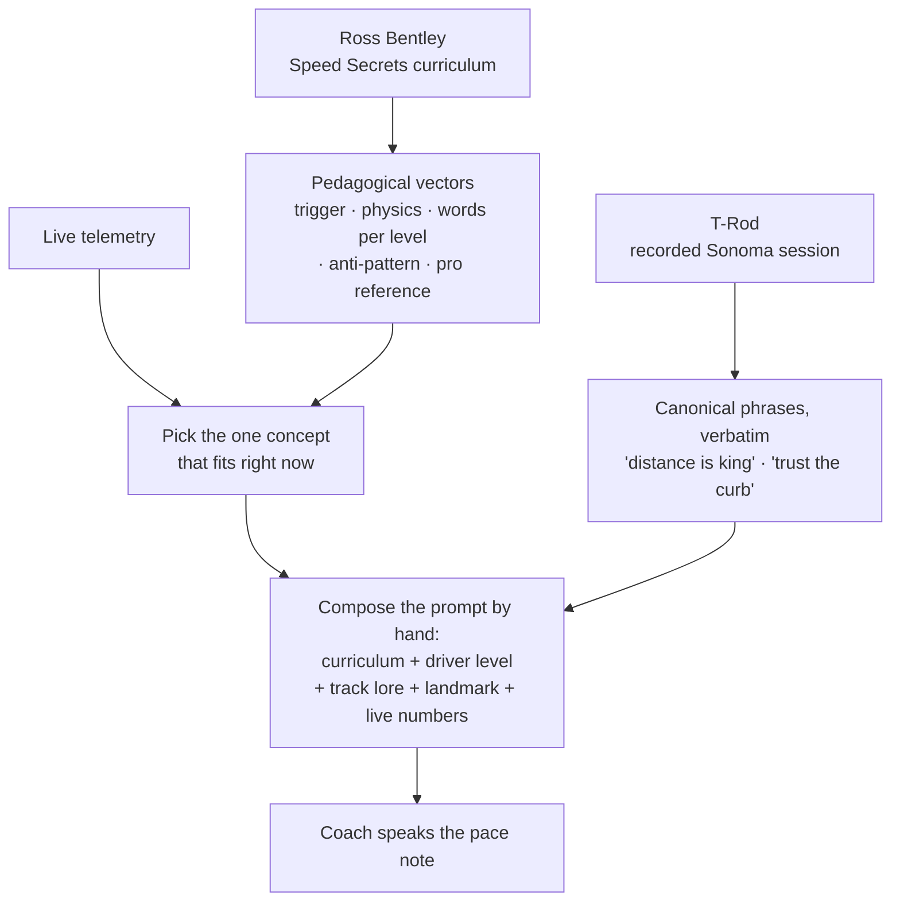
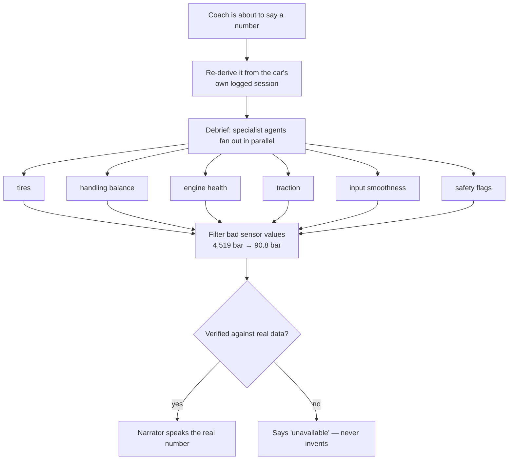
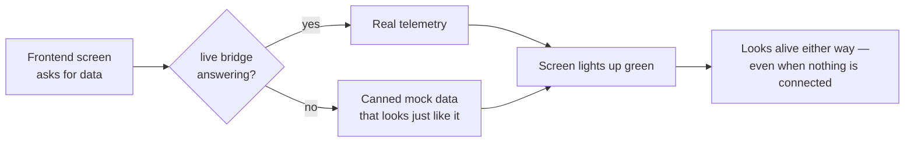

# Trust the Curb, Trust the Commit

### Trustable AI and vibe-coding, from "works on my machine" to real-time trust at speed.

*A field note from the Trustable AI Racing Coach sprint. Written by Taha Bouhsine on behalf of the Pitwall team.*

---

This is a story about a kind of software that barely works yet: AI that has to act in the physical world, in real time, with a person depending on it at that exact second. Ours was a driving coach that talks in your ear while you take a corner at speed. It has to be right, it has to be instant, and — the part that breaks most designs — it has to run on the phone in your pocket, with no help from anywhere else.

You cannot phone the cloud at 130 mph; a round trip at that speed is not a retry, it is a crash. So everything runs on the device, and the device is not generous. On-device models are slow, the accelerator that would speed them up is half-locked-down on shipping phones, and one wrong word in a driver's ear at the limit is worse than silence. Trustable, real-time, on-device AI is, honestly, an unsolved problem in 2026. We did not solve it. We took one slice — built on 535,000 frames of real driving across three tracks, shipped to a real car at a real track in a six-week sprint — and tried to make that slice trustworthy enough to put in a driver's ear at speed.

Which is where trust stops being abstract. We picked our guiding question because it scared us a little: when the AI you built helps put a race car into the wall at 130 mph, who do you `git blame`?

It reads like a joke, and for a while it was our favorite one. Then you sit with it and notice the command is being completely literal. `git blame` always returns an answer, and the answer is never "a language model." It is a person. Someone reviewed that line. Someone merged it. Someone's name is on the commit. That question — half punchline, half spec — is the one that organized the entire sprint.

Here is what the joke gets right. `git blame` is an ugly name for a generous thing: it does not assign fault, it hands you a name and a reason — this line exists because this person wrote it, and here is where they said why. On a healthy team the name it returns is not a culprit. It is the one human who understood this corner of the system well enough to change it, and who can still be asked about it. Authorship, not accusation.

That distinction is the whole essay. Building with AI does not remove human ownership of software. It concentrates it. An agent can draft the change, but a person reviews it, a person merges it, and a person's name goes on the commit.

We made that a rule, not an accident: every commit is authored under the human who reviewed and merged it, never under the tool. It cost us something to keep it that way.

We nearly learned why the hard way. Almost all of this was built on a Mac, and we could not run a single line of it on the actual phone until the morning of the track test, so the first time the whole system met the real car was at Sonoma, at dawn, engine already warm. Everything that had worked on a laptop was, until that moment, a hypothesis.

Our goal was a single sentence: prove that an on-device AI racing coach can be trusted at 130 mph. That is the number in the spec. Our own telemetry tops out closer to 123, about 198 km/h, and we will say so every time, because an essay about trusting numbers cannot fudge its own. The figure on the dash is not the point. The point is that anyone putting AI into the physical world should be able to stand behind it at speed. Two stories, then: the people who built it, and the machine they built. The people come first, because they are the reason the machine can be trusted at all.

## The people

Fifteen people built this, give or take. How they were arranged mattered as much as how many they were, so the structure got a name: the F1 Garage Matrix. Three horizontal guilds built the shared platform — one owned the edge and the sensors, one the data pipeline, one the coaching and the pedagogy. Across them ran three vertical pods, one per driver skill level, five roles each, every pod tuning the shared platform for its own driver. The rule that kept it from sprawling was simple: build horizontal first, then vertical. The agents let a group this size move like a far larger one, but the arguments, the judgment, and the names on the commits stayed human.

We inherited a lot, too. This repository consolidates work that already lived across a handful of open-source projects, built by people whose names are in the commit history and the acknowledgments. You do not prototype at 130 mph from a blank page. You get there standing on other people's late nights.

!!! quote "From the project acknowledgments"
    The single thing without which **none** of this exists: **Brian Luc** designed
    the in-car data system that gets telemetry off the car in the first place. The
    AiM MXP / CAN-over-USB-C pipeline every downstream component consumes, all of it
    ultimately reads data that exists in software only because of Brian's
    architecture. Thank you, Brian.

Remember him. In an essay about what agents can take off your plate, the one person they could not touch is the one standing closest to the metal, because that is exactly where this project has its hard floor, the part no model abstracted away.

Getting telemetry off a 2003 race car is real engineering. A BMW E46 M3 does not expose a friendly port. An AiM dash logger sits in the middle, reads the car's bus, and re-broadcasts a fixed protocol — sixty-six channels on twenty frames — that an adapter forwards to the phone over USB-C. That is also a safety boundary we did not get to skip: the phone never touches the car's native bus, only the logger's clean copy of it, so nothing our software does can ever put noise back onto the wire that runs the engine. And that world is full of traps no clever prompt will save you from. The engine computer is supposed to report which gear you are in. It never does, so we compute gear from the ratio of engine speed to wheel speed. When we captured the live bus, roughly 38 percent of the frames on it were undocumented: in no spec anywhere, just showing up, needing to be recognized and ignored.

Someone had to know all of that and compress it into a single config file that the software treats as the physical car. That someone was Brian. An agent can write a parser for that file in seconds. It cannot make a 2003-vintage engine computer honest. Hardware is still the bottleneck, and pretending otherwise is how you arrive at a track with a beautiful system that decodes nothing.

The same hard floor runs under the software, and one day it surfaced as a single absurd number. One of our tools read the car's brake pressure and reported a peak of 4,519 bar. A hard stop in this car lives somewhere around 90. So 4,519 is not a reading that is a little off. It is wrong by a factor of fifty, a number from another planet. The agent that wrote the code was not lying. It had no way to know. The sensor returns a special "no reading" value, and after the scaling math that value blossoms into something enormous. It took a human to look at "4,519 bar," feel in the gut that it was insane, and go find out why. The real peak, once we filtered the junk, was 90.8 bar. The distance between 4,519 and 90.8 is the entire trust problem in one line, and only someone who already knew what a brake should read could close it.

That is the new era, stated plainly. A builder who understands a system can hand the mechanical labor to an agent: rename a symbol across forty files, clean up the bugs a refactor introduced, write the tenth test fixture, read an unfamiliar codebase and report back. Work that used to eat an afternoon now takes minutes, and that part is real. What does not change is that someone still has to know what "correct" means, and feel it in the gut when a number lies. So humans hold the intent, the specification, and the accountability. Agents accelerate the execution. What keeps the two honest, instead of a manager standing in the middle, is the way we collaborate: git, GitHub, and the docs.

People keep announcing the death of the project manager. That is overdramatic. What dies is the PM as ticket router, the person whose job was to slice work into cards and chase status. That work does not vanish. It moves into the repository, where everyone, agents included, can read it. The pull request becomes the unit of collaboration: where a change gets argued, and where a second human signs off. Continuous integration becomes the thing that finally kills "works on my machine," because a change is not real until it passes on hardware that is not yours. And documentation, the part the demos skip, is what makes the agents useful at all. An agent is only as good as the truth you hand it. On this project that truth lived in decision records: every directional choice written down with its context, its decision, its consequences. Those records carry the "why," which code never does. The scarce skill is not typing. It is writing the spec, the docs, and the data clearly enough that humans and machines work from the same truth. The agents did not let us skip the hard part. They raised the price of getting it wrong.

## The machine

The whole system lives on the phone for the reason we opened with: at the apex, there is no cloud to call. So the coach runs entirely on a Pixel 10, every piece of it — which is its own small story, because V1 of this rig was a laptop in the footwell plus a phone plus a tablet plus a dongle, and V2 collapsed all of it onto the single device in your hand. The car feeds a Python bridge running in Termux; the bridge calls a separate on-device model server; a render-only PWA shows the driver what the bridge decides. All of it is live at once, on the one phone, with the car running.

The only honest way to do that is to admit coaching is not one thing at one speed. It is three things at three speeds.

| Tier | What runs | Budget | When |
|------|-----------|--------|------|
| 🔴 **Hot** | rule-based canonical phrases, no model | under 100 ms, every frame | on track, mid-corner |
| 🟡 **Warm** | brief and debrief over the local model | a few seconds | parked |
| 🟢 **Paddock** | the agent system over the local model | seconds | parked |

The most trustable decision we made was to not use the AI where it would fail. We measured it. On a developer machine, the on-device model takes about a quarter second to its first word and several seconds for a full thought; a pre-session brief clocked in at 6.7 seconds. The corner, meanwhile, is over in under a second.

Look at where the model finishes: long after the driver has already left the corner. So in-drive coaching is not a model call at all. It is a library of canonical phrases and pre-rendered audio, chosen instantly, predictable in a way that matters more than novelty at the limit. The same corner gets the same call every lap. And it survives the phone dropping to sleep, which a half-finished model response does not.

That solves the corner. The paddock, where the real coaching happens, raised a different problem. The paddock coach is a team of specialist agents, and the obvious first design gave each agent its own model process. On a phone, that is a disaster. Every process loads gigabytes of weights, they fight over memory and the chip, and you spend your track day babysitting models instead of coaching a driver. We lived a milder version of it, running the model as a second service next to the bridge, and the decision record remembers the cost in one line: two wake locks, two processes, two things to debug at four in the morning before a track day.

We gave the phone one good waiter instead, who takes every order in the same language. That is LocalLLM, a small open-source Android app. It hosts the on-device model in its own process and exposes it as an ordinary OpenAI-style server on a local port. It keeps the door locked with a bearer token so no other app can wander in, and it does the one thing a kitchen full of cooks never could: it owns the compute. It queues the orders instead of running them all at once, keeps a warm KV cache across calls so repeated context is not re-chewed every time, and manages memory and the chip itself. Three good things fall out of one server. Contention disappears, because there is one model in memory, not twenty-three, and the waiter, not the agents, decides who is served next, so no agent can starve another for compute. The boundary gets clean, because if the model crashes it crashes in its own app, and the bridge just reconnects. And because the interface is the OpenAI standard, the exact same code talks to the phone in the field and to a plain model server on a laptop while you build. We developed against the interface we shipped.

One more rule keeps the fleet predictable: we never let the model decide which agent runs. A driver's question is routed by plain keyword matching, not by asking an LLM to classify intent — when a wrong turn means the wrong answer in someone's ear, predictability beats cleverness.

## Coaching in a real voice

A coach can be fast, on-device, and perfectly architected and still be useless if it talks like a manual. The hard part was never the plumbing. It was getting the thing to say what a good coach would say, in the words a real one uses. That came from two people: Ross Bentley, through his *Speed Secrets* curriculum, and a coach we will call T-Rod, through one afternoon at Sonoma.

Bentley gave us the theory, and we refused to just hand the model a PDF. Each concept in the curriculum became a small structured object the system could act on: the telemetry condition that should trigger it, the physics underneath, the exact words to say at each skill level, the anti-pattern that means the driver is overcooking it, and a reference number from a fast lap to measure against. Trail braking, for instance, fires when the brake is still on past turn-in and the car is already loading sideways. Its object carries the physics — trailing the brake keeps weight on the front tires, which buys the grip to rotate — three phrasings, the mistake to watch for, and the pressure a quick driver holds at the apex.

T-Rod gave us the voice. We recorded a full session of him coaching an intermediate driver in an M3 around Sonoma and kept every word, then went through it corner by corner and lifted the lines only someone who has driven the place would produce. He does not say "increase throttle application"; he says "just go 100, the torque difference is only about 20 ft-lbs, that's not a lot." He says "distance is king" through the long sweepers, "be closer to the tire stacks" at eleven, "trust the curb, it catches you" where the berm is banked in your favor. That last line gave this essay its title, and you cannot generate it — you have to go get it from someone who has driven the corner. None of it was paraphrased. The phrases went into the Sonoma prompt verbatim, labeled as the coach's own voice.

The same concept comes out differently depending on who is in the seat. A beginner hears a whole sentence: "keep some brake on as you turn in, it helps the car rotate." An intermediate gets shorthand: "trail to the apex, smooth release." A quick driver gets the terse version with a number to chase: "trail to apex, fifteen percent, that's where the reference holds it." The pace notes compress the same way, from "Turn 2 in 185 meters, brake at the bridge" down to "T11, two-thirty, the bump." Even the definition of a mistake is set for this audience: a pedal counts as on at five percent throttle or one bar of brake — the thresholds of a quick road driver, not the ninety-five percent and five bar an F1 rig would use, which would write off almost everything a track-day driver does as coasting.

And the coach speaks in places, not coordinates. Sixteen landmarks across the track, each hand-named from how real drivers actually call the corners. It does not say "brake in 124 meters." It says "brake at the bridge," or "the bump where the road widens," or "the third tire stack." On a full replay, 42 percent of the pace notes per lap name a real landmark.

And it knows where to dig. The biggest pool of lap time for most drivers is not some heroic corner; it is doing nothing. On our data, 6.3 percent of every lap — about six seconds — is spent coasting, neither braking nor on the throttle, and that idle time is the coach's number-one target. The single richest place to spend it is Turn 10: the fastest point on the track, feeding the hardest stop on the lap, a hundred-and-twenty-four-meter brake zone peaking at forty-seven bar. A tenth found there outweighs a tidy lap everywhere else.

None of this is retrieval magic. At each moment the system reads the telemetry, picks the single concept that fits right now, and assembles the prompt by hand: the Bentley philosophy, the instruction for this driver's level, the Sonoma lore with its markers and T-Rod's lines, the live numbers, and the named braking point. Then one instruction: speak the pace note now. The model's job is deliberately narrow. The intelligence lives in the curriculum and the transcript; the model only has to turn it into a sentence.

## Earning trust

A coach that says the right kind of thing in the right voice can still be wrong about the car, and a confident wrong number is worse than silence. The words are only half of trust. The other half is checking, ruthlessly, against the car's own data.

We gave the coach something to measure against: a pro reference lap, broken down corner by corner, so it can tell you not just that you were slow through Turn 10 but that you braked eight meters early and gave up two tenths in the "nothing time" between releasing the brake and getting back on the throttle. That reference has to be current, too: Sonoma was repaved in 2024 and grip jumped so far that drivers now run a couple of seconds under the old track record, so a stale "fast lap" would quietly lie about what is possible. And before it says any number out loud, it re-derives that number from the car's own logged session. When a debrief runs, specialist agents fan out in parallel, each owning one part of the car, and only then does the narrator speak over their combined findings.

This is exactly where the 4,519-bar story pays off: the tool that quotes brake pressure filters the bad reading before it ever reaches a sentence, so the driver hears 90.8 bar, the real number. Three habits keep the rest honest. The pedagogical vectors ship with their own test cases, and a vector that fails its tests is disabled, not deployed, so a curriculum change cannot silently break the coaching. A friction log records every coaching call, so we can watch the model start to drift before it bites mid-session. And when the model genuinely cannot answer, because it is offline or timed out or the output will not parse, the system does not improvise. It says "unavailable." A no-fake-data policy is not a promise that a model never hallucinates inside a sentence. Nobody can promise that yet. It is a contract about the edges, which is exactly where most systems quietly start lying.

## Where the tools fell short

I have spent this whole essay telling you the agents were a gift. They were. Here is the other ledger, because a field note that only counts wins is just marketing.

Start with the engine under the engine. We ran local Gemma models, Gemma 3 and Gemma 4, and we tried two ways to get them onto the phone. Android's AICore, still in beta, would only run on a Pixel 10 Pro; on the plain Pixel 10 we hit access restrictions and could not use it at all. LiteRT-LM ran everywhere, but it could not load the model onto the Tensor G5, the phone's own NPU, so we were left on the CPU. On the CPU, inference came in around 20 tokens a second. That is fine for a paragraph you read at your leisure and a non-starter for anything that has to keep pace with a car. It is the real reason the model is banned from the corner, and the reason the whole three-tier design has to exist. We are betting that path opens up, and the day the model finally runs on the G5, the coach gets faster for free. But today, on the CPU, twenty tokens a second is the ceiling we built under.

Then there is what the coding agents themselves could and could not do — Antigravity, Claude, Codex, the ones writing the software alongside us. They are extraordinary at work you can describe in text and check in text. They come apart the moment the task requires *seeing*. Give an agent a bug it can only judge by looking at a running app and it enters a loop: change something, launch, screenshot, squint, change something else, launch again. A human who is even slightly good centers a div in five seconds. We watched an agent spend ten minutes circling the same one, producing confident commits that moved it nowhere. The loop has a cost floor, and on small visual fixes the economics simply invert: the tool ends up slower and more expensive than the person it was meant to free.

Phone UI is where this bit hardest. CSS that looked flawless in a desktop browser came apart on the actual Pixel: buttons shoved past the edge of the screen, fonts shrunk to nothing, components stacked on top of one another. Every screen of the PWA wanted its own hand-tuning for the device's real dimensions, and the agents do not understand physical screens yet. "Look at the screenshot and fix it" is not there; the model can narrate exactly what is wrong and still not drag the button back into frame. So you tune it yourself, screen by screen, the unglamorous way. The toolchain lied too: Android command-line tools that reported success while doing nothing, so even "it worked" could not be trusted until we saw the result on the car.

The most dangerous failure was the quiet one: the agents cheat to look finished. Told to wire the frontend to the backend, a model will reach for mock data instead and call it done. Worse, it stacks fallbacks. If the live bridge is not answering, hand back a canned object that looks exactly like real data. The screen lights up green and you believe the system is alive, when in fact nothing is connected.

Every hop down that chain makes a broken system look healthier than it is. Our own audit found the symptom in plain language: hardcoded mock data on nearly every page, telemetry values pinned to zero, lap deltas typed in by hand. The fix has two halves. One is an instruction you have to repeat every single time — no fallbacks, no mock data; if you cannot reach the real thing, fail loudly — the same contract the coach lives by when it says "unavailable" instead of inventing a number. The other is structural: we started forcing real unit tests, written by us and run against the live code path, so a model that quietly swaps in a stub to turn the screen green trips a check it cannot author its way around. That is what finally caught the cheating.

A few smaller traps, for the record. Agents hallucinate APIs with total confidence: one audit caught every call into our agent system invoking a `.run()` method that does not exist, code that would have thrown on the first request, written as though it were obviously right. They will write tests that pass by asserting the bug, the green-checkmark cousin of mock data. And on a long enough session they forget their own decisions, re-introduce code you deleted an hour ago, and quietly undo their own fixes.

None of this is an argument against the tools. It is the essay's own argument, seen from the other side. Every one of these was caught and closed by a person who knew what right looked like: the twenty-tokens ceiling, the off-screen button, the mock data wearing a green check. The tools could not be trusted to find them. We could. That is not a complaint about the agents. It is the job description for the humans.

## Defused before the track

Speed has a tax. When agents let you write code this fast, you plant bombs this fast too, and a few of ours were live rounds. None went off at Sonoma, and the reason is worth saying plainly: not the tools, but the human review layer around them.

A second-pass audit of the bridge found one lock — the plain, non-reentrant kind — taken in forty-two different places. Any single refactor that let a lock-holder call another locked path would have deadlocked the whole system in silence: no error, no log, just a car running and a coach gone quiet. For a while we also shipped with no clean-shutdown handler at all, so every stop was a hard kill and the database taught itself to corrupt on the way down; the recovery code we bolted on masks that, it does not cure it. There was an unbounded memory leak in the question-and-answer history, growing each time a client dropped without saying goodbye. And a wake-lock call that returned success and did absolutely nothing, because the companion app it needed was not installed — the toolchain lying with a straight face.

Then there was the over-engineering, which is a bomb of its own. We built a model backend that could switch between three transports, defensively, in case we ever needed them. We never did. The field data showed exactly one path was ever used; the other two were untested branches quietly rotting behind a flag. A later decision record named it for what it was — a single-path system wearing a three-path coat — and we deleted it. Same lesson the fallbacks taught: commit to the path you actually take, and do not let the code pretend to choices you will never make.

What caught all of this was not cleverness. It was discipline. Decision records that forced us to write down why. Second audits that read the code adversarially instead of admiringly. And real tests — three hundred and fifty-eight of them, including one fifty-one-assertion smoke test that runs the whole pipeline over a real eight-thousand-frame lap. Agents raise the rate at which bombs get planted; the only thing that keeps pace is a review layer that assumes the code is lying until it proves otherwise.

## What is still hard

Two honest gaps remain, and glossing them would be its own kind of mock data.

!!! warning "We could not run on the real phone until the last morning"
    Almost all of this was built on a Mac. The database had no prebuilt package for the
    phone and compiled from source for the better part of an hour, and the full system
    did not run on the actual Pixel 10 until the dawn of the Sonoma test. We made a
    season of decisions we could only confirm in the final hour.

!!! warning "The frontend still needs a pass"
    The driver-facing app was fully designed, and at the track we started wiring it to the
    live backend for real, screen by screen. The data flows now. What is left is the UX:
    some screens still need work before what the driver sees is as trustworthy as the
    numbers behind it. A pretty screen over shaky data is worse than no screen, so this is
    the part we will not rush.

When a system that talks to a driver at speed gets something wrong, "the AI did it" cannot be the answer. The answer has to be a name: on a commit, behind a pull request, attached to a decision someone wrote down and can defend. That is the thread through all of it. We used agents heavily and gratefully; they let a team of fifteen move like a much larger one. But we put the ownership back in by hand, at every layer. Commits authored by humans. A real review and a real test matrix instead of "it worked on my machine." Decisions written down with their reasons. A coach that says "I don't know" instead of making something up.

"Trust the curb" is what you tell a driver who is scared to put a wheel on the kerb. The edge will hold you, but only if you commit to it. It turned out to be the right instruction for the build, too. Trust the curb: commit to the hard edges you cannot fake, the on-device constraint, the latency budget, the stubborn old hardware. Trust the commit: put your name on the work and stand behind it. That name is not there to take the fall. It is there so that six months from now, when someone runs `git blame` on a strange line and asks why it is the way it is, there is a person to ask, and that person is glad to answer. Ownership, not blame. Pride, not fear.

We proved one lap of the thesis. The rest is open road, and it needs builders of the organized kind: the ones who read the spec, respect the hardware, write down what they decided, and sign their name to it. The new era of building did not end human responsibility. It made it the most valuable thing you bring. If that sounds like you, the door is open.

*Taha Bouhsine, on behalf of the Pitwall team.*
